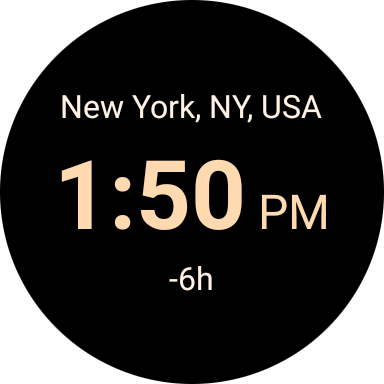
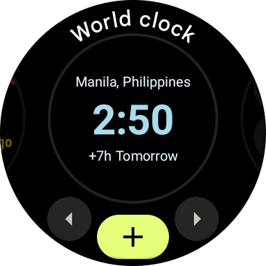
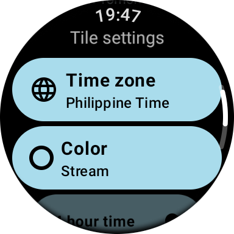
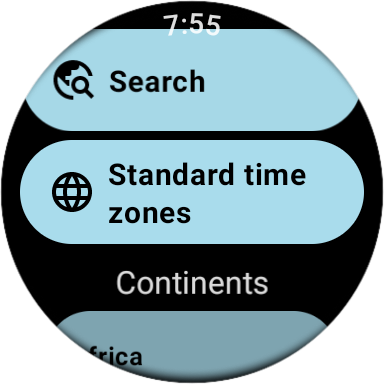
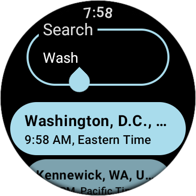

# World Clock for WearOS

View the timezone of up to 10 cities of the world and add them as tiles to your Wear OS watch.

     

## How to use

Once installed you will be able to add only one timezone tile.

To add more, tap on the tile, select "All cities…" and tap "Add city".

The tiles will show up in the "Add to carousel" menu. Long press any tile and click `+` to add them.

## Personal Project Policy

This app is a **Personal Project**.

This means that this is something I created in my free time because I needed it myself, and I
decided to share it with the world.

If you like the app I'm happy to hear that! And if you have suggestions or if you find any bugs
please do let me know!

However, please be aware that you're not entitled to (even if you purchased the paid version):

- Receiving support
- Having any bugs fixed
- Having any features added

If you would like to make the changes yourself, you're very welcome to send me a pull request.

## License

This project is licensed under multiple licenses, depending on the file.

The following files are licensed under the GNU General Public License v3.0:

- `WorldClockTileService.kt`
- `TileSettingsActivity.kt`
- `TileSettingsViewModel.kt`

The information about continents, timezones and cities can be considered common knowledge and is
therefore in the public domain.

An acknowledgement however needs to be made
to [kevinroberts/city-timezones](https://github.com/kevinroberts/city-timezones/) for the neatly
organized city-to-timezone mapping data.

The remaining files and information are licensed under the Apache License 2.0.

### What does this mean to you?

The app is Free and Open-Source Software and you are therefore free to use it, modify it and
redistribute it, for the most part.

You can take most of the code and use it in your own projects, as long as you follow the terms of
the Apache License 2.0.

**However, usage of any of the GNU GPL v3.0 files requires you to also redistribute the source code
of your entire project under the same license.**

More specifically this means that a fork of this project must be licensed under the GNU GPL v3.0:
the GPL "spreads" to any work that includes GPL-licensed code.

### App stores policy

- **F-Droid:** Feel free to publish it and let me know. F-Droid maintainers: please tag me in the
  issue/PR before merging; I'm `@Depau` on GitLab as well.
- **Other FOSS stores:** I'll probably be cool with it but please contact me first.
- **Proprietary stores, including Google Play, Huawei, Amazon, etc:** Do not publish it. I will
  challenge any attempt to do so.

